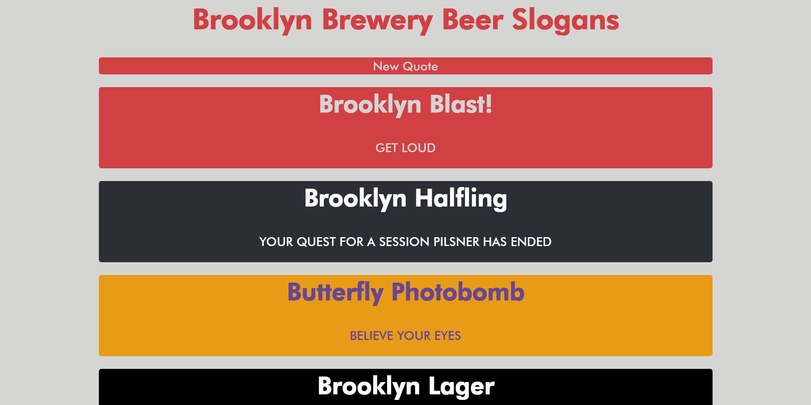

# Brooklyn Brewery Beer Slogans

A interactive slogans react app.

## Technologies Used
- React
- JavaScript
- HTML5
- SASS
- CSS3
## Description
This react app displays a continuous stream of slogans for beers from Brooklyn Brewery.
### Goal
Make a react app that captures the theme of Brooklyn Brewery using their own beer slogans.
### Notes
- React and JavaScript used to provide components to the webpage when prompted by the user.
- SASS is used to increase simplicity for the styling.
- Best practices for accessibility was used for this project when the color scheme allowed.
- In addition to responsiveness for larges screens, repsonsiveness was also provided for smaller screens like smartphones with the use of media queries.
- Deployed using Netlify